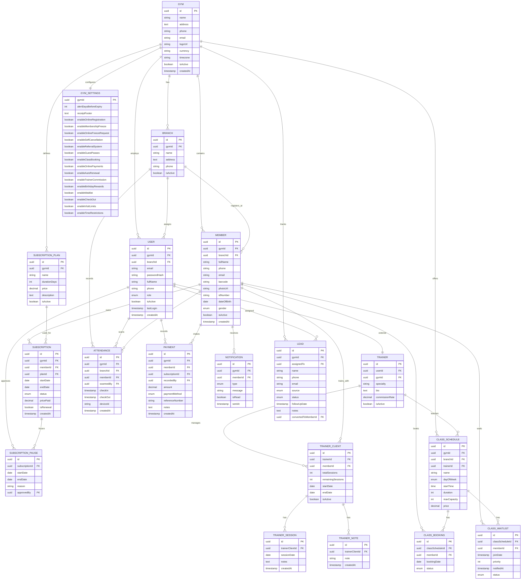

# Gym SaaS - Entity Relationship Diagram (ERD)

> **Note:** To view this Mermaid diagram in VS Code:
>
> 1. Install **"Markdown Preview Enhanced"** extension
> 2. Open this file and press **Ctrl+Shift+V** (or Cmd+Shift+V on Mac)
> 3. The diagram will render automatically

## Visual Diagram (Mermaid)



---

## Entity Descriptions

### Core Entities

| Entity     | Description                                                                   | Primary Key | Key Relations                     |
| ---------- | ----------------------------------------------------------------------------- | ----------- | --------------------------------- |
| **GYM**    | The tenant/root entity. Each gym is a separate customer of the SaaS platform. | `id` UUID   | Has many branches, users, members |
| **BRANCH** | Physical location of a gym. A gym can have multiple branches.                 | `id` UUID   | Belongs to GYM                    |
| **USER**   | System users across all roles (Super Admin, Gym Admin, Staff, Trainer)        | `id` UUID   | Belongs to GYM and BRANCH         |

### Member Management

| Entity                 | Description                                | Primary Key | Key Relations                         |
| ---------------------- | ------------------------------------------ | ----------- | ------------------------------------- |
| **MEMBER**             | Gym members who use the facility           | `id` UUID   | Has subscriptions, attendance records |
| **SUBSCRIPTION_PLAN**  | Template packages (Monthly, Yearly, etc.)  | `id` UUID   | Belongs to GYM                        |
| **SUBSCRIPTION**       | Active membership linking member to a plan | `id` UUID   | Links MEMBER + PLAN                   |
| **SUBSCRIPTION_PAUSE** | Freeze records for paused memberships      | `id` UUID   | Belongs to SUBSCRIPTION               |

### Attendance & Payments

| Entity         | Description                | Primary Key | Key Relations               |
| -------------- | -------------------------- | ----------- | --------------------------- |
| **ATTENDANCE** | Check-in/check-out records | `id` UUID   | Links MEMBER + BRANCH       |
| **PAYMENT**    | Financial transactions     | `id` UUID   | Links MEMBER + SUBSCRIPTION |

### Trainer System

| Entity              | Description                     | Primary Key | Key Relations             |
| ------------------- | ------------------------------- | ----------- | ------------------------- |
| **TRAINER**         | Trainer profile extending USER  | `id` UUID   | One-to-one with USER      |
| **TRAINER_CLIENT**  | Link between trainer and member | `id` UUID   | Links TRAINER + MEMBER    |
| **TRAINER_SESSION** | Individual training sessions    | `id` UUID   | Belongs to TRAINER_CLIENT |
| **TRAINER_NOTE**    | Progress notes for clients      | `id` UUID   | Belongs to TRAINER_CLIENT |

### Class Management

| Entity             | Description               | Primary Key | Key Relations           |
| ------------------ | ------------------------- | ----------- | ----------------------- |
| **CLASS_SCHEDULE** | Recurring class templates | `id` UUID   | Belongs to GYM + BRANCH |
| **CLASS_BOOKING**  | Member reservations       | `id` UUID   | Links MEMBER + SCHEDULE |
| **CLASS_WAITLIST** | Waitlist for full classes | `id` UUID   | Links MEMBER + SCHEDULE |

### Additional

| Entity           | Description                       | Primary Key  | Key Relations       |
| ---------------- | --------------------------------- | ------------ | ------------------- |
| **GYM_SETTINGS** | Feature toggles and configuration | `gymId` UUID | One-to-one with GYM |
| **NOTIFICATION** | System notifications to members   | `id` UUID    | Belongs to MEMBER   |
| **LEAD**         | Potential members (CRM)           | `id` UUID    | Belongs to GYM      |

---

## Key Relationships Explained

### 1. Multi-Tenancy Pattern

```

GYM (tenant)
├── BRANCH 1
├── BRANCH 2
├── USER (Gym Admin)
├── USER (Staff at Branch 1)
├── MEMBER 1 (registered at Branch 1)
├── MEMBER 2 (registered at Branch 2)
└── SUBSCRIPTION_PLAN (Monthly)
└── SUBSCRIPTION (Member 1)

```

Every entity has a `gymId` foreign key for tenant isolation.

### 2. User Role Hierarchy

```

SUPER_ADMIN (platform level)
└── Can access all gyms

GYM_ADMIN (gym level)
├── Can access all branches
└── Assigned to GYM

STAFF (branch level)
└── Assigned to specific BRANCH

TRAINER (gym level)
└── Linked to MEMBERs via TRAINER_CLIENT

```

### 3. Subscription Lifecycle

```

MEMBER
└── SUBSCRIPTION (active)
├── SUBSCRIPTION_PLAN (Monthly)
├── PAYMENT (EGP 500)
└── SUBSCRIPTION_PAUSE (optional, if frozen)
├── startDate
├── endDate
└── reason: "Travel"

```

### 4. Attendance Flow

```

MEMBER (scans barcode)
└── ATTENDANCE
├── branchId (where they checked in)
├── checkIn (timestamp)
├── checkOut (optional)
├── scannedBy (USER who scanned)
└── deviceId (scanner identifier)

```

### 5. Trainer System Flow

```

TRAINER (User with role=TRAINER)
└── TRAINER_CLIENT (Member assigned)
├── totalSessions: 10
├── remainingSessions: 7
└── TRAINER_SESSION (completed session)
├── sessionDate
└── notes: "Good progress"

```

---

## Indexes for Performance

```sql
-- For barcode scanning (critical path)
CREATE INDEX idx_members_barcode ON members(barcode);
CREATE INDEX idx_members_gym_id ON members(gymId);

-- For today's attendance queries
CREATE INDEX idx_attendance_check_in ON attendance(checkIn);
CREATE INDEX idx_attendance_gym_id ON attendance(gymId);
CREATE INDEX idx_attendance_branch_id ON attendance(branchId);

-- For subscription lookups
CREATE INDEX idx_subscriptions_member_id ON subscriptions(memberId);
CREATE INDEX idx_subscriptions_status ON subscriptions(status);
CREATE INDEX idx_subscriptions_end_date ON subscriptions(endDate);

-- For payment reports
CREATE INDEX idx_payments_gym_id ON payments(gymId);
CREATE INDEX idx_payments_created_at ON payments(createdAt);

-- For trainer lookups
CREATE INDEX idx_trainer_clients_trainer_id ON trainer_clients(trainerId);
CREATE INDEX idx_trainer_clients_member_id ON trainer_clients(memberId);
```

---

## Generating Visual Diagram

To generate a visual image from this Mermaid diagram:

### Option 1: Mermaid Live Editor

1. Visit: https://mermaid.live
2. Copy the Mermaid code above
3. Export as PNG/SVG/PDF

### Option 2: VS Code Extension (Recommended)

1. Install **"Markdown Preview Enhanced"** extension
2. Open this file in VS Code
3. Press **Ctrl+Shift+V** (or Cmd+Shift+V on Mac) to open preview
4. The diagram will render automatically
5. Right-click → "Save as Image" to export

### Option 3: CLI Tool

```bash
# Install mermaid-cli
npm install -g @mermaid-js/mermaid-cli

# Generate PNG
mmdc -i ERD.md -o erd-diagram.png
```

### Option 4: Online Tools

- https://www.mermaidchart.com
- https://dbdiagram.io (can import SQL)

---

## Database Schema SQL

See [PRD.md](./PRD.md) Section 6 for complete SQL schema with:

- Table definitions
- Relationships
- Constraints
- RLS policies
- Partitioning setup

---

_Last Updated: 2026-02-02_
